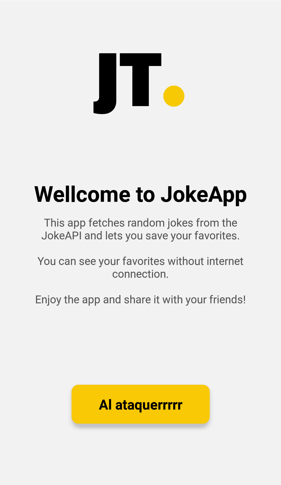
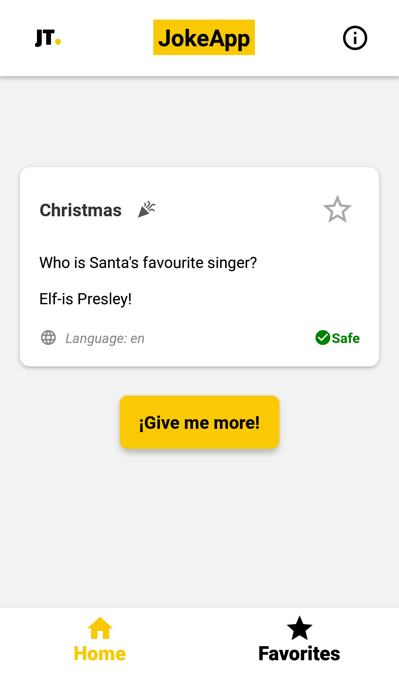
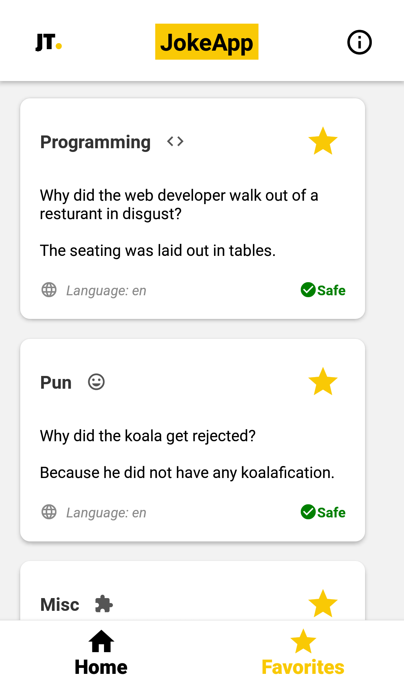
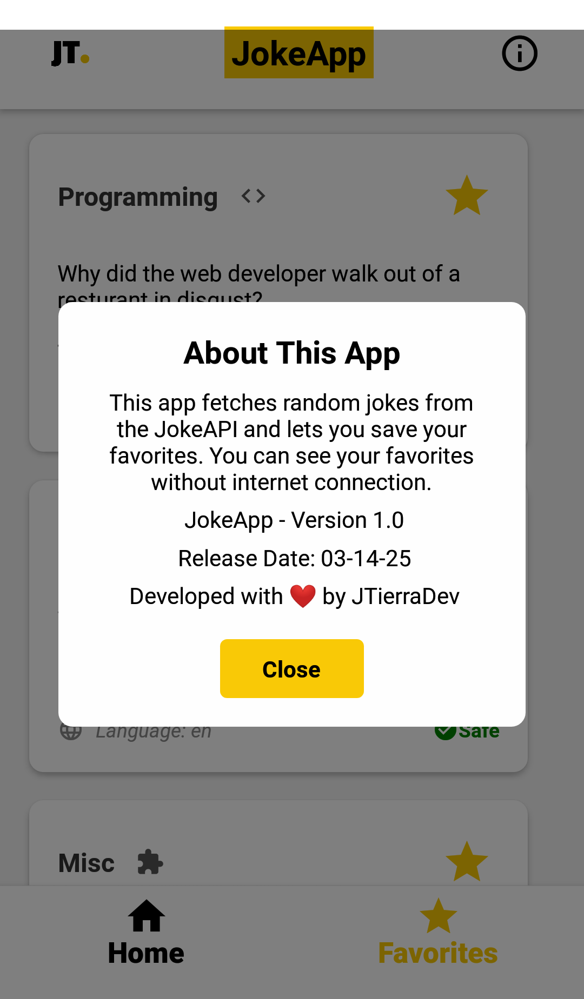

⚡️ Project Context

    Important note:
    This app was developed in just 4 days as a technical test for a job application. The instructions were:

        “Please create a joke app that fetches and displays random jokes from JokeAPI.
        It must have two tabs: Home and My Favorites. In Home, users can save jokes to their favorites list.
        The Favorites tab must display saved jokes and allow users to remove them.
        Please provide a working APK and the code (GitLab repo) for testing. You can use Expo to build the APK.”

    Originally, the app used the company’s logo and brand colors. Out of respect and privacy, the logo image has been replaced with a personalized version that keeps the original color palette.

    ✅ The only changes made before uploading to GitHub:

        Updated the Expo SDK for compatibility:

            npx expo install expo@latest

            npx expo install --fix

        Substituted the original logo.

    ⚙️ Many improvements could still be made, but the project is kept as-is to reflect its original purpose:
    a quick technical test done in a short timeframe.
    
# 😂 JokeApp

JokeApp is a mobile application that fetches random jokes from the **JokeAPI** and allows users to save their favorite jokes.  
It features **two main screens**:  
✅ **Home Screen** – Displays random jokes with an option to save them as favorites.  
✅ **Favorites Screen** – Lists saved jokes and allows users to remove them.

This app was developed using **React Native** and built with **Expo** for easy deployment.

---

## 📥 Installation & Running the Project

To run the app on your local machine, follow these steps:

### 1️⃣ Clone the repository
```sh
git clone https://github.com/JTierraDev/JokeApp.git
cd JokeApp
```

### 2️⃣ Install dependencies
```sh
npm install
```

### 3️⃣ Run the app
```sh
npx expo start
```
Then, **scan the QR code with the Expo Go app** on your phone to run the application. 📱

---

## 🏗️ Project Structure

```
JokeApp/
│── assets/             # App icons, images, and splash screen
│── components/         # UI components like JokeCard and Header
│── context/            # Context API for managing favorites
│── navigation/         # React Navigation configuration
│── screens/            # Main app screens (Home, Favorites, Welcome)
│── services/           # API service to fetch jokes
│── App.js              # Main application file
│── package.json        # Project dependencies
│── README.md           # Project documentation (this file)
```

---

## 📌 Features

- Fetches random jokes from [JokeAPI](https://sv443.net/jokeapi/v2/)
- Allows saving jokes as favorites
- Favorites are stored using React Context API
- Clean UI with Material Icons for better user experience
- Built-in **help modal** with app information
- Simple navigation using **React Navigation**

---

## 🎯 How to Use the App

1. Open the app, and a **random joke** will be displayed.
2. Tap **"Give me more"** to get a new joke.
3. Tap the ⭐ **star icon** to save a joke as a favorite.
4. Go to **Favorites** tab to view saved jokes.
5. Tap the **star icon** again in the favorites screen to remove a joke.

---

## 📦 Generating the APK (Android Package)

This app was built using **Expo EAS Build** for easy APK generation.

To generate the APK:

1. Install Expo CLI globally:
   ```sh
   npm install -g expo-cli
   ```

2. Run the build command:
   ```sh
   eas build --platform android
   ```

3. Expo will provide a **download link** once the build is complete.

---

## 🚀 Future Improvements

Some possible enhancements for future versions:

- 🌍 **Multi-language support** (currently only English).
- 🔎 **Search jokes by category** (Programming, Christmas, etc.).
- 🎨 **Dark mode support** for better UX.

---

## 📸 App Screenshots

<p align="center">
  
  
  
  
</p>

---

## 👨‍💻 Author

- **Developer:** Jaime Tierra (JTierraDev)
- 📅 **Release Date:** March 14, 2025
- ✉️ **Contact:** [jtierra.dev@outlook.com](mailto:jtierra.dev@outlook.com)
- 🌐 **GitHub Repository:** [JokeApp](https://github.com/JTierraDev/JokeApp)

---

## 🛠️ Technologies Used

| Tech Stack  | Description |
|-------------|------------|
| **React Native** ⚛️ | Mobile app development framework |
| **Expo** 🚀 | Simplifies deployment and development |
| **React Navigation** 🔄 | Handles navigation between screens |
| **JokeAPI** 😂 | Fetches jokes from an open-source API |
| **Context API** 📂 | Manages global state for favorites |